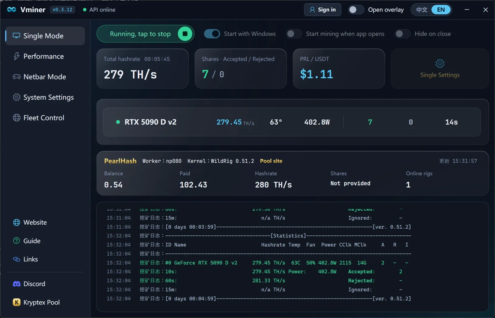

# Vminer

### Mining manager for Windows PRL and macOS BTX. Unzip and run.

[中文](README.md) | [English](README.en.md)

---

## 📖 What is Vminer

Vminer is a desktop mining manager. Unzip the package and double-click to run.

- **Windows edition**: built for PRL mining on **NVIDIA GPUs**, with multiple pools and mining kernels built in: one-click setup, connectivity checks, status monitoring, and pool balance lookup.
- **macOS edition**: built for BTX mining on Apple Silicon Macs. It uses encrypted proxy mode by default and lets users fill in their own wallet and worker name before mining.

It is designed for NVIDIA users who want quick pool setup, kernel switching, hashrate and share display, and pool balance lookups.

  

## 📥 Download

| Platform | Current version | Download | How to start |
|---|---:|---|---|
| Windows | v0.2.x | [Download latest Windows release](https://github.com/heishiqing/Vminer/releases/latest) | Unzip the package and double-click `Vminer.exe` |
| macOS Apple Silicon | v0.0.1 | [Download Vminer-mac-v0.0.1.zip](https://github.com/heishiqing/Vminer/releases/download/mac-v0.0.1/Vminer-mac-v0.0.1.zip) | Unzip the package and double-click `Vminer.app` |

macOS release page: [mac-v0.0.1](https://github.com/heishiqing/Vminer/releases/tag/mac-v0.0.1). If macOS shows a first-run security prompt, right-click `Vminer.app` in Finder and choose Open once.

The Windows package includes `使用说明.md` and `User Guide.md`.

> 🆕 **What's new in v0.2.7**: added F2Pool SRBMiner username-mode support · fixed a missing signed-profile verification entry for F2Pool / SRBMiner · fixed slim-client kernel downloads through pinned public 443 HTTPS · improved backup-line handling and download logs for better recovery when the HK line is unhealthy. Full log in [CHANGELOG](CHANGELOG.md).

> 🔗 **PearlHash / P-pool MDL binding helper**: for pools that require PRL-to-MDL wallet binding, download the [MDL wallet binding signature helper](https://github.com/heishiqing/pearl-mdl-bind-helper/releases/latest/download/P.MDL.zip), unzip it, and run the Chinese one-click script.

## ✨ Features

- **One-click mining**: enter a wallet, pick a pool, hit start — the matching kernel is downloaded and launched automatically.
- **MDL dual mining**: supports PRL + MDL merge mining on compatible pools, with separate PRL and MDL wallet addresses.
- **Multiple pools**: 8 pools built in, switch inside the app.
- **Status display**: online state, GPU count, hashrate, accepted shares, rejected shares, and mining state at a glance.
- **Runtime logs**: miner output, pool connection state, and program messages.
- **Pool balance lookup**: view pool-side balance, paid, shares, and online rigs inside the app (no VPN needed in mainland China).
- **Related Sites**: one-click access to the official site, wallet, block explorer, and pool websites.
- **Live price in-app**: view the real-time PRL price inside the app (no VPN needed in mainland China).
- **Auto run**: start with Windows, auto mine after launch, and background silent mode.
- **Cyber-cafe diskless systems**: copy a fully configured client folder to the master image; new PCs can read pool, kernel, dual-mining, wallet and worker-name rules, while empty worker names automatically use each PC's computer name.
- **Power & fan**: NVIDIA power-limit percentage plus fan-speed control (re-checked every 5 minutes and re-applied if it drifts).
- **Startup self-check**: connectivity, GPU driver, or antivirus issues raise a clear prompt and stop — no blind retry loop.
- **Worker name**: add a prefix or generate randomly to tell machines apart.
- **Refreshed UI**: dark-glass style with a left sidebar, smoother to use.

## 🍎 macOS BTX edition

- Supports Apple Silicon macOS devices.
- Uses encrypted proxy mode by default.
- Ships with an empty user wallet; users fill in their own wallet on first run.
- Supports Chinese/English UI, launch at login, auto mine after app launch, floating window, pool-side hashrate/share sync, and BTX/USDT price display.
- Current miner kernel: `dexbtx-miner 0.4.20`.
- Current pool: `minebtx`. Pool statistics are shown according to the pool API response.

## 🖥️ GPU compatibility

**NVIDIA-only**, focused on N-card efficiency and stability. Vminer filters available kernels and pools by detected GPU.

## 🔌 Windows supported pools, mining software, and coin

**Coin:** PRL

**Pools (8):** AlphaPool, LuckyPool, F2Pool, HeroMiners, Kryptex, 2Miners, PearlFortune, PearlHash

**Mining software:** SRBMiner, AlphaMiner, WildRig, TW (pearl-gpu) — auto-matched to the selected pool; downloaded on demand at first launch to keep the package slim.

| Pool | Supported software | MDL dual mining / notes |
|---|---|---|
| AlphaPool | AlphaMiner | MDL dual mining supported |
| LuckyPool | SRBMiner, TW (pearl-gpu) | MDL dual mining supported with SRBMiner |
| F2Pool | TW (pearl-gpu), SRBMiner | Uses F2Pool username / sub-account; in-app pool stats are not supported yet |
| HeroMiners | SRBMiner, TW (pearl-gpu) | MDL dual mining supported with SRBMiner |
| Kryptex | SRBMiner, TW (pearl-gpu) | PRL single mining |
| 2Miners | SRBMiner, TW (pearl-gpu) | PRL single mining |
| PearlFortune | TW (pearl-gpu) | P-pool binding mode, use the MDL binding helper above |
| PearlHash | WildRig | PRL single mining |

**Kernel versions:** SRBMiner 3.3.9 / 3.4.1 / 3.4.2 / 3.4.3; AlphaMiner 1.7.7 / 1.8.3 / 1.8.6; WildRig 0.48.9 / 0.49.1 / 0.49.2; TW 2.2.1 / 2.2.6 / 2.3.1 / 2.3.2. The selectable versions follow the server-side manifest and may update over time.

## 🚀 Quick start

1. Enter your PRL wallet address.
2. Enter a worker name (can be random).
3. Select a pool and node (the kernel is matched automatically).
4. Select direct or encrypted proxy mode.
5. Click "Test connectivity"; if it passes, click "Start".

## 💬 Community and feedback

| Channel | Link |
|---|---|
| QQ Group | **245770181** |
| GitHub Issues | [Open an issue](https://github.com/heishiqing/Vminer/issues) |
| Changelog | [CHANGELOG.md](CHANGELOG.md) |

## ⚠️ Disclaimer

Make sure you have the right to run mining software on the current device. Mining may increase power consumption, hardware temperature, and device wear. Earnings, pool stability, and network connectivity are not guaranteed. Follow local laws, regulations, and platform rules.

## ❤️ Support the author

If you like Vminer, consider supporting the author on Afdian.

  

## 🔗 Other projects

- [Vbot-B](https://github.com/heishiqing/Vbot-B): Bilibili private message auto-reply bot.
