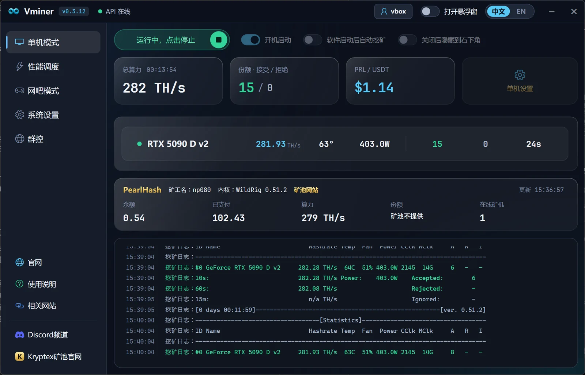

# Vminer

### Windows PRL 挖矿客户端，解压即用

[中文](README.md) | [English](README.en.md)

---

## Vminer 是什么

Vminer 是面向 PRL（Pearl）的 Windows 桌面挖矿管理工具。下载压缩包、解压、双击程序即可使用，主要面向 NVIDIA 显卡，提供多矿池、多挖矿内核、连接检测、状态监控和矿池信息查询。

  

## 下载

| 系统 | 当前版本 | 下载 | 启动方式 |
|---|---:|---|---|
| Windows | v0.3.2 | [下载 Vminer-v0.3.2.zip](https://github.com/heishiqing/Vminer/releases/download/v0.3.2/Vminer-v0.3.2.zip) | 解压后双击根目录 `Vminer.exe` |

压缩包内包含 `使用说明.txt` 和 `User Guide.txt`。

## Windows 版功能

- 一键挖矿：填写钱包或矿池用户名、选择矿池、点击开始。
- 多矿池：支持 AlphaPool、LuckyPool、F2Pool、HeroMiners、Kryptex、2Miners、PearlFortune、PearlHash。
- 多内核：支持 SRBMiner、AlphaMiner、WildRig、TW pearl-gpu、PeakMiner，按所选矿池自动匹配，并从服务器签名列表获取可用版本。
- 状态显示：在线状态、显卡数量、算力、份额、拒绝份额、运行日志。
- 稳定恢复：优化断线、长时间无任务和无有效份额时的自动恢复，并降低慢份额矿池的误判。
- 明确诊断：钱包/用户名、矿池登录、内核下载、显卡和网络异常提供中英文提示。
- 相关网站：一键打开官网、钱包、区块浏览器、矿池和交易所等链接。
- 自动运行：支持开机启动、软件启动后自动挖矿。
- 网吧无盘：支持配置随客户端目录保存，便于复制到母盘。

## Windows 内核适配列表

| 挖矿内核 | 当前版本 | PRL 适配矿池 |
|---|---:|---|
| SRBMiner | 3.4.7 | LuckyPool、HeroMiners、Kryptex、2Miners、F2Pool |
| AlphaMiner | 1.7.7 | AlphaPool |
| WildRig | 0.49.6 | PearlHash |
| TW pearl-gpu | 3.2.2 | LuckyPool、HeroMiners、Kryptex、2Miners、F2Pool、PearlFortune |
| PeakMiner | 2.4.2 | LuckyPool、HeroMiners、Kryptex、AlphaPool、F2Pool、2Miners |

内核版本由服务器签名列表动态提供，客户端打开版本下拉框即可刷新可用版本；旧版本会按兼容性需要保留。

## 快速开始

1. 下载对应系统的压缩包。
2. 解压到本地文件夹。
3. 双击启动程序。
4. 填写钱包地址和矿工名。
5. 选择矿池和连接方式，点击开始挖矿。

## 交流与反馈

| 渠道 | 入口 |
|---|---|
| QQ 群 | **245770181** |
| GitHub Issues | [提交 issue](https://github.com/heishiqing/Vminer/issues) |
| 更新日志 | [CHANGELOG.md](CHANGELOG.md) |

## 免责声明

请确认你有权在当前设备上运行挖矿程序。挖矿可能带来电力消耗、硬件温度上升和设备损耗风险。收益、矿池稳定性和网络连通性不做保证。请遵守所在地法律法规和平台规则。

## 支持作者

如果喜欢本软件，可以助力作者发电。

  

## 作者其他项目

- [Vbot-B](https://github.com/heishiqing/Vbot-B)：B 站私信自动回复机器人。
- [pearl-proxy](https://github.com/heishiqing/pearl-proxy)：PRL 加密转发软件。
