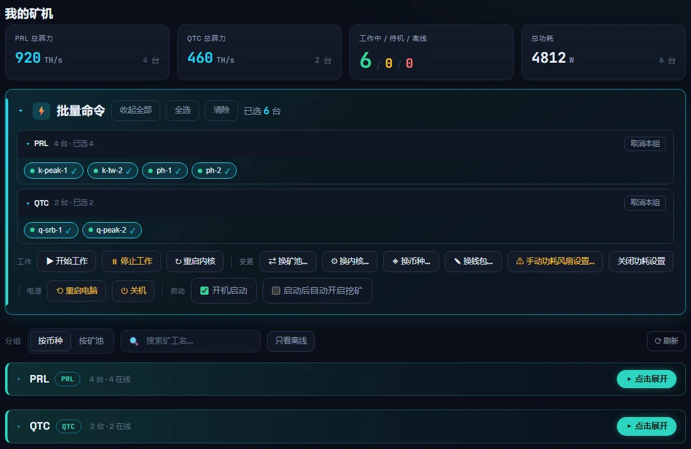
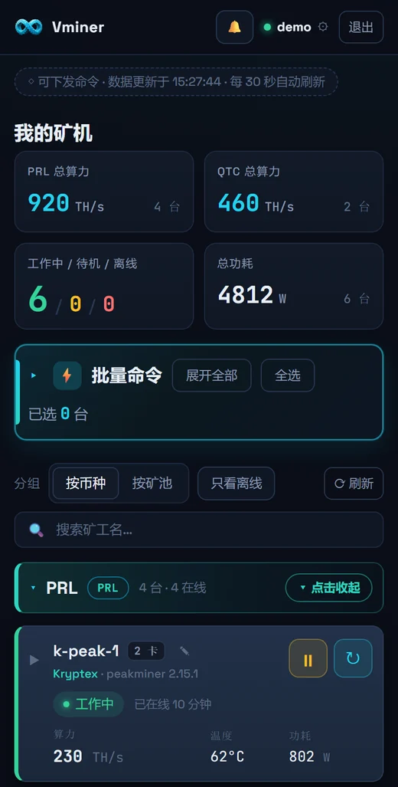

# Vminer

### Windows 原生多币种 GPU 挖矿客户端 · 解压即用

**PRL（Pearl） · QTC（Quantus）**　｜　也支持 XTM（Tari）　｜　N 卡 / A 卡

[中文](README.md)　｜　[English](README.en.md)　·　官网 [www.vminers.com](https://www.vminers.com/)

---

## ✨ Vminer 是什么

Vminer 是 Windows 原生的多币种 GPU 挖矿客户端,主打 **PRL（Pearl）** 与 **QTC（Quantus）**,并支持 **XTM（Tari）**,更多币种陆续接入。下载压缩包、解压、双击即用,无需 WSL2、Docker 或命令行。选好矿池后,客户端会自动匹配可用的挖矿内核,首次使用时按需下载并校验哈希。

  

> 🎮 **网吧模式** —— 一个总开关,三种让位方式:全力(一直挖)、规避(名单里的游戏一开就让出显卡)、智能(看显卡占用,游戏一开就让,看网页视频照常挖)。开机后台静默运行,快捷键呼出;挖矿时可自动调低功耗,让给游戏时恢复 100%。
>
> 🖥️ **网吧无盘** —— 配置随客户端目录写进母盘并持久化,分机开机自动读回钱包直接开挖,母盘装一次全场即挖。
>
> 📱 **群控** —— 在客户端登录账号,就能用手机、平板、电脑打开 [app.vminers.com](https://app.vminers.com/) 远程批量管理全场矿机。

  　
   群控网页 · 电脑与手机(演示数据)

## ⬇️ 下载

**[下载最新版 →](https://github.com/heishiqing/Vminer/releases/latest)**

- 系统要求:Windows 10 / 11 64 位,一张独立显卡:N 卡(NVIDIA)或 A 卡(AMD)。A 卡目前通过 SRBMiner 挖 PRL / QTC(Kryptex、HeroMiners、LuckyPool),通过 lolMiner 挖 XTM。
- 解压后双击根目录的 `Vminer.exe` 启动。
- 压缩包内附 `使用说明.txt` 和 `User Guide.txt`。
- 安装包不带挖矿内核,内核在你第一次选用时才下载并校验文件哈希,所以包很小。
- 请只从本仓库 Releases 或官网 [www.vminers.com](https://www.vminers.com/) 下载,可用发布页给出的 SHA-256 校验文件。

## 🚀 快速开始

1. 下载并解压,双击 `Vminer.exe`。
2. 选择币种和矿池,客户端会自动筛出这个矿池能用的内核。
3. 填写你自己对应币种的钱包地址(Kryptex 也可以填用户名)。
4. 点击「开始」,首页即可看到算力、份额和收益。

## 🎛️ 主要功能

- 🪙 **多币种** —— 主打 PRL 与 QTC,并支持 XTM,下拉菜单直接切换。
- 🔀 **多矿池、多内核自动匹配** —— 先选矿池,客户端自动筛出可用内核;部分矿池只能用自家官方内核,客户端已限定好。
- 🔄 **内核版本在线更新** —— 内核版本由服务器签名清单提供,下拉框显示各内核当前版本,无需手工放文件。
- 📊 **实时监控** —— 总算力、份额、矿池余额、币价;每张显卡单独显示算力、温度和功耗。
- 📱 **群控** —— 登录 [app.vminers.com](https://app.vminers.com/),按币种或矿池分组查看全部矿机的算力、温度、功耗和在线状态;批量开始 / 停止、换矿池 / 内核 / 币种 / 钱包、调功耗风扇、远程重启或关机;网页上的操作,客户端界面同步变化。
- 🎛️ **超频** —— 功耗、风扇、核心、显存一页调好;温度自动联动(温度高了自动降功耗、加风扇,凉下来逐档恢复);同型号显卡一起改,一键恢复默认。超频调节支持 N 卡,A 卡可看实时状态。
- 🛟 **掉驱动自动重启** —— 可选开启:确认显卡掉驱动、挖矿停了之后自动重启电脑,重启后自动接着挖;有次数上限,不会反复重启。N 卡 / A 卡通用。
- 🔒 **数据全程加密** —— 客户端与服务器之间的通信全程加密传输。
- ♻️ **自动更新** —— 默认开启;下载走主备两条线路,失败自动切换,并校验文件完整性。
- 🩺 **起挖自检** —— 启动前检查显卡驱动、杀毒软件拦截和网络,有问题直接提示。
- 🖥️ **后台运行** —— 开机自启、启动后自动挖矿、关闭后隐藏到托盘,快捷键呼出界面。

## ⛏️ 支持的矿池与内核

| 币种 | 矿池 | 挖矿内核 | A 卡 |
|---|---|---|:---:|
| **PRL** | AlphaPool | AlphaMiner | — |
| **PRL** | HeroMiners | SRBMiner / TW-Pearl-Miner / PeakMiner | ✓ |
| **PRL** | Kryptex | SRBMiner / TW-Pearl-Miner / PeakMiner | ✓ |
| **PRL** | LuckyPool | SRBMiner / TW-Pearl-Miner / PeakMiner | ✓ |
| **PRL** | PEARLSKI | PEARLSKI 官方内核 | — |
| **PRL** | PearlHash | WildRig | — |
| **PRL** | PearlFortune | SRBMiner / PeakMiner | — |
| **QTC** | Kryptex | SRBMiner | ✓ |
| **QTC** | LuckyPool | SRBMiner | ✓ |
| **XTM** | Kryptex | lolMiner | ✓ |

矿池和内核列表以客户端内为准,服务器会通过签名清单在线更新,新增矿池或内核版本时一般无需重新下载客户端。

## 💵 费用

Vminer 免费下载;**没有多余手续费,仅收取内核的 2%**。收益直接进你自己的钱包。

## ❓ 常见问题

- **会被杀毒软件误报吗?** 这类算力软件有时会被杀毒软件的启发式规则误报。如遇拦截,把 Vminer 加入信任列表即可。
- **客户端显示的份额和矿池后台对不上?** 两边统计口径不同(动态难度、统计窗口、延迟等),**以矿池后台入账为准**。
- **需要提供私钥吗?** 不需要。挖矿只需要钱包**地址**。任何索要私钥、助记词或让你转币的,都是骗子。

## 💬 交流与反馈

| 渠道 | 入口 |
|---|---|
| Discord | [加入 Vminer 社区](https://discord.gg/XYwrTWjHGE)(官方唯一交流与反馈渠道) |
| 官网 | [www.vminers.com](https://www.vminers.com/) |
| 群控 | [app.vminers.com](https://app.vminers.com/) |
| GitHub Issues | [提交 issue](https://github.com/heishiqing/Vminer/issues) |
| 更新日志 | [CHANGELOG.md](CHANGELOG.md) |

## ⚠️ 免责声明

请确认你有权在当前设备上运行挖矿程序。挖矿可能带来电力消耗、硬件温度上升和设备损耗风险。收益、矿池稳定性和网络连通性不做保证。请遵守所在地法律法规和平台规则。
